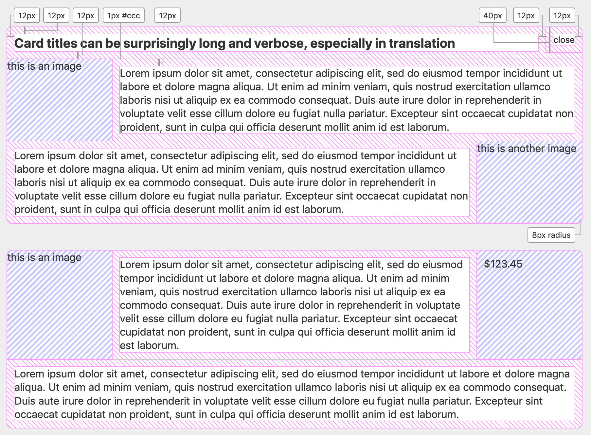

# The Exercise 

Following a copy of the text stored in HackerRank

## Instructions

This exercise is a conversation starter which explores your HTML, CSS, and JavaScript abilities. We hope to complete the conversation in person! After a member of our team approves you to move to the next level, we schedule you to come in. During the in-person technical interview we discuss your code: you can explain why you did what you did, alternatives you were considering, and things you didn't understand, and we can question your thinking and answer questions.

We do not expect you to complete the entire exercise in 75-minutes, so please do not expect this of yourself! Instead, it is more important that you demonstrate all three abilities (HTML, CSS, and JavaScript) and not just one or two abilities. When you get stuck, add comments to the code and move on. We want to know how you think, so adding comments is very important. Again, finishing is not required or expected, but comments, when you run out of time, helps us understand your thinking. Please add comments to your code!

Relax and treat this as a normal coding experience. Reference your usual resources (online documentation such as MDN, your own notes, books, etc.)

Output: Your code will render the component described below and will dynamically use the content provided in the JSON object. We expect you to build the HTML, and populate the HTML with content, through JavaScript. Please style the output per the spec list.

Tooling

    Feel free to use your own IDE. You can copy the code into your own IDE, get it working, then paste it back.
    We have placed all code in the HTML tab so it's easy to copy. If you wish, you can use the other two tabs.
    To view your changes, click "Render". This is a required step every time you make a change which you wish to view.
    If you want to pull in jQuery or something else from a CDN, just link to it in the HTML.

Best of luck! We hope to meet you!

## Component Specs

- background color #fff
- text color #333

---
- 12px gutter around each separate piece of text content
- 8px radius on the component corners
- 1px border between title and content sections, #ccc

---
- 20px font size for title
- if the title is too long for the width, it should wrap.
- the title should never display below the dismiss action

---
- dismiss action stays in top right
- 40px minimum click/touch target dimensions for dismiss action
- dismiss action hover: add underline to text, background color #ddd
- 14px font size for dismiss action, horizontally and vertically centered within the action
- clicking the dismiss action should cause the card to go away

---
- media area 25% width, no greater than 160px width; always fill vertically
- media area may be left or right side, or both

---
- may be one or more content sections containing text area and/or media area
- content area can be clicked to navigate (link behavior)
- entire card (except title section) can be clicked to navigate (link behavior)
- entire content section can be clicked to navigate, including media (link behavior)
- content area and media area can be clicked to navigate to separate destinations (alternate behavior)



## JSON Object
```json
[
    {
        heading: {
            title: 'Card titles can be surprisingly long and verbose, especially in translation',
            dismiss: {
                label: 'close'
            }
        },
        content: [
            {
                media: {
                    left: {
                        image: {
                            url: 'https://via.placeholder.com/150',
                            description: 'this is an image'
                        },
                        link: {
                            url: '/some/image-gallery/',
                            description: 'view an entire gallery of images'
                        }
                    }
                },
                main: {
                    text: `Lorem ipsum dolor sit amet, consectetur adipiscing elit, sed do eiusmod tempor incididunt ut
                        labore et dolore magna aliqua.`,
                    link: {
                        url: '/somewhere/else',
                        description: 'go somewhere else'
                    }
                }

            },
            {
                link: {
                    url: '/to/another/view',
                    description: 'see a different view'
                },
                media: {
                    right: {
                        image: {
                            url: 'https://via.placeholder.com/180x150',
                            description: 'this is another image'
                        }
                    }
                },
                main: {
                    text: `Ut enim ad minim veniam, quis nostrud exercitation ullamco
                        laboris nisi ut aliquip ex ea commodo consequat.`
                }

            }
        ]

    },
    {
        content: [
            {
                media: {
                    left: {
                        image: {
                            url: 'https://via.placeholder.com/160',
                            description: 'this is an image'
                        }
                    },
                    right: {
                        text: `$123.45`
                    }
                },
                main: {
                    text: `Duis aute irure dolor in reprehenderit in
                        voluptate velit esse cillum dolore eu fugiat nulla pariatur.`,
                    link: {
                        url: '/somewhere/else',
                        description: 'go somewhere else'
                    }
                }

            },
            {
                main: {
                    text: `Excepteur sint occaecat
                        cupidatat non proident, sunt in culpa qui officia deserunt mollit anim id est laborum.`
                }

            }
        ]

    }
];
```